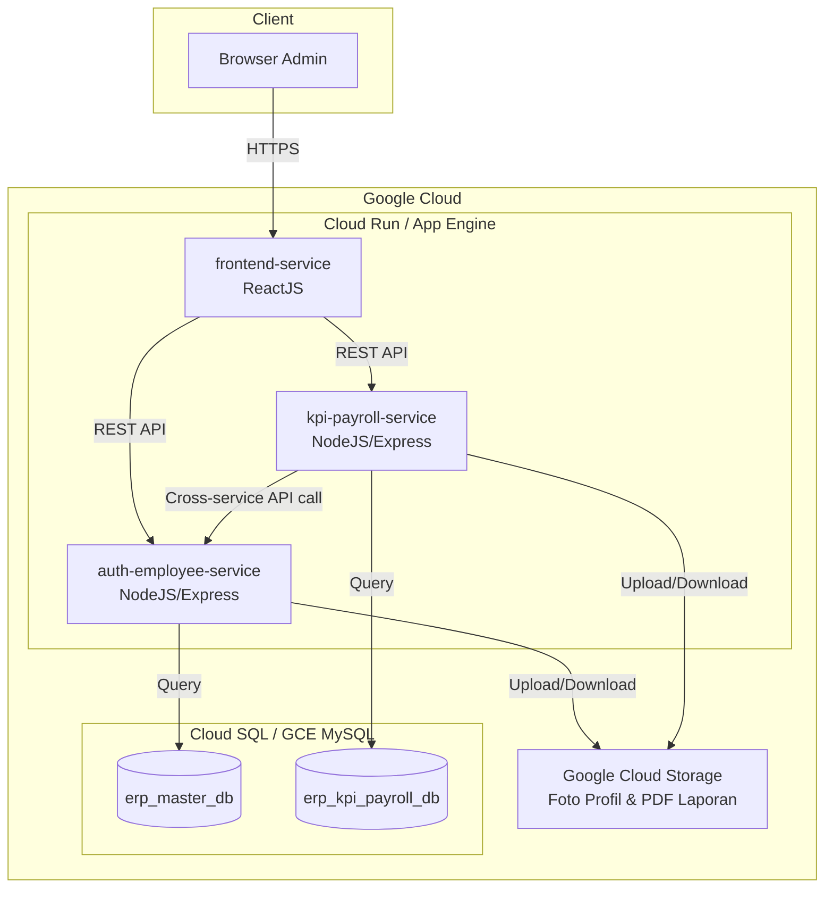
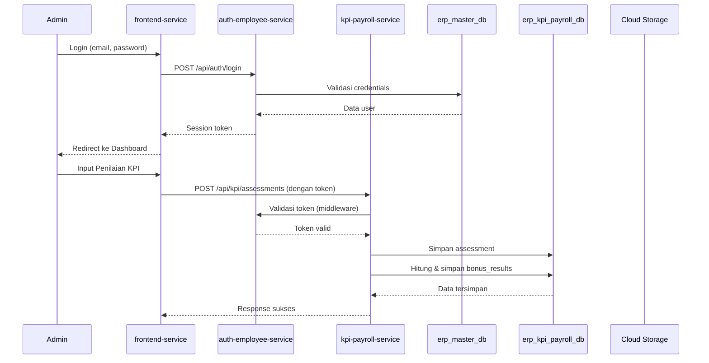
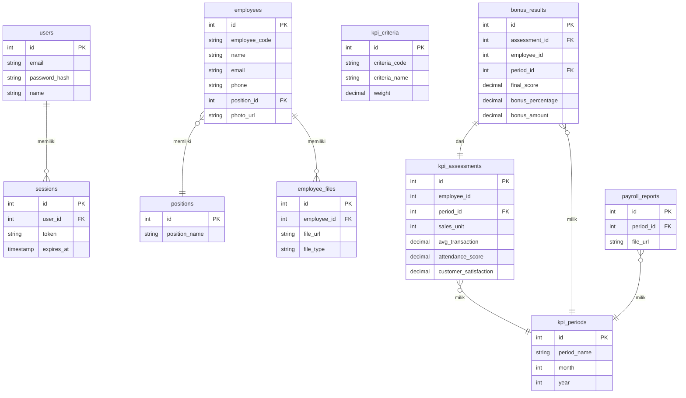

# Dokumen Desain: ERP KPI Salesman

## Ikhtisar

Sistem ini adalah WebApp ERP sederhana untuk penilaian KPI (Key Performance Indicator) salesman mobil dan perhitungan bonus gaji. Satu-satunya pengguna adalah Admin yang mengelola seluruh operasi: manajemen karyawan, input capaian KPI, kalkulasi skor SAW, penentuan bonus, dan unduh laporan PDF.

Sistem dibangun dengan arsitektur **3 microservice** yang di-deploy di Google Cloud:

- **frontend-service**: ReactJS, antarmuka pengguna Admin
- **auth-employee-service**: NodeJS/Express, autentikasi + manajemen karyawan
- **kpi-payroll-service**: NodeJS/Express, KPI, bonus, laporan PDF

Dua database MySQL terpisah digunakan untuk isolasi data master dari data transaksi KPI.

---

## Arsitektur

### Diagram Arsitektur Sistem



### Alur Request Utama



### Keputusan Desain Arsitektur

1. **Pemisahan database**: `erp_master_db` menyimpan data master (users, employees, sessions), `erp_kpi_payroll_db` menyimpan data transaksi (KPI, bonus, laporan). Pemisahan ini memungkinkan scaling independen dan menjaga kejelasan domain.

2. **Cross-service validation**: `kpi-payroll-service` melakukan validasi referensi `employee_id` dengan memanggil API `auth-employee-service`, bukan akses langsung ke `erp_master_db`. Ini menjaga batas domain antar service.

3. **Shared token validation**: Middleware autentikasi diimplementasikan di masing-masing service dengan memanggil `auth-employee-service` untuk memvalidasi token, sehingga tidak ada service yang menyimpan secret bersama.

4. **Cloud Storage untuk file**: File biner (foto, PDF) disimpan di GCS, bukan di database, untuk efisiensi dan skalabilitas.

---

## Komponen dan Antarmuka

### frontend-service (ReactJS)

#### Halaman dan Komponen Utama

| Halaman | Path | Deskripsi |
|---|---|---|
| Login | `/login` | Form email + password |
| Dashboard | `/` | Ringkasan statistik sistem |
| Daftar Karyawan | `/employees` | Tabel karyawan + tombol aksi |
| Form Karyawan | `/employees/create`, `/employees/:id/edit` | Form tambah/edit |
| Detail Karyawan | `/employees/:id` | Detail + upload foto |
| Jabatan | `/positions` | CRUD jabatan |
| Periode KPI | `/kpi/periods` | CRUD periode |
| Input KPI | `/kpi/assessments/create` | Form 4 kriteria KPI |
| Rekap Bonus | `/kpi/recap` | Tabel bonus + filter periode |
| Laporan PDF | `/reports` | Daftar laporan + download |

#### State Management

Menggunakan React Context API + `useReducer` untuk state global (auth token, user info). Data fetching menggunakan `fetch` atau `axios` dengan interceptor untuk menyertakan token pada setiap request.

#### Protected Routes

Semua halaman selain `/login` dibungkus `PrivateRoute` component yang memeriksa keberadaan session token. Jika tidak ada, redirect ke `/login`.

---

### auth-employee-service (NodeJS/Express)

#### Endpoint API

| Method | Path | Deskripsi |
|---|---|---|
| POST | `/api/auth/login` | Login admin |
| POST | `/api/auth/logout` | Logout admin |
| GET | `/api/auth/validate` | Validasi token (dipanggil service lain) |
| GET | `/api/employees` | Daftar semua karyawan |
| POST | `/api/employees` | Tambah karyawan baru |
| GET | `/api/employees/:id` | Detail karyawan |
| PUT | `/api/employees/:id` | Update karyawan |
| DELETE | `/api/employees/:id` | Hapus karyawan |
| POST | `/api/employees/:id/photo` | Upload foto profil |
| GET | `/api/positions` | Daftar jabatan |
| POST | `/api/positions` | Tambah jabatan |
| PUT | `/api/positions/:id` | Update jabatan |
| DELETE | `/api/positions/:id` | Hapus jabatan |

#### Middleware Stack

```
Request → CORS → Body Parser → Rate Limiter → [Auth Middleware] → Route Handler → Error Handler → Response
```

Auth Middleware hanya aktif pada endpoint yang memerlukan autentikasi (semua kecuali `/api/auth/login`).

---

### kpi-payroll-service (NodeJS/Express)

#### Endpoint API

| Method | Path | Deskripsi |
|---|---|---|
| GET | `/api/kpi/periods` | Daftar periode KPI |
| POST | `/api/kpi/periods` | Tambah periode baru |
| GET | `/api/kpi/periods/:id` | Detail periode |
| PUT | `/api/kpi/periods/:id` | Update periode |
| DELETE | `/api/kpi/periods/:id` | Hapus periode |
| GET | `/api/kpi/assessments` | Daftar penilaian KPI |
| POST | `/api/kpi/assessments` | Input + hitung penilaian KPI |
| GET | `/api/kpi/assessments/:id` | Detail penilaian |
| PUT | `/api/kpi/assessments/:id` | Update penilaian |
| DELETE | `/api/kpi/assessments/:id` | Hapus penilaian |
| GET | `/api/kpi/recap` | Rekap bonus semua karyawan |
| GET | `/api/kpi/recap?period_id=X` | Rekap bonus per periode |
| GET | `/api/kpi/recap/:id` | Detail bonus karyawan |
| POST | `/api/reports/generate/:period_id` | Generate laporan PDF |
| GET | `/api/reports` | Daftar laporan PDF |
| GET | `/api/reports/:id/download` | Download laporan PDF |

#### Logika Kalkulasi SAW

Kalkulasi SAW diimplementasikan sebagai pure function di module `services/sawCalculator.js`:

```
calculateSAW(assessment) → { sales_score, transaction_score, final_score, bonus_percentage, bonus_amount }
```

---

## Model Data

### erp_master_db

#### Tabel `users`

| Kolom | Tipe | Constraint | Keterangan |
|---|---|---|---|
| id | INT | PK, AUTO_INCREMENT | |
| email | VARCHAR(255) | UNIQUE, NOT NULL | Email login |
| password_hash | VARCHAR(255) | NOT NULL | Bcrypt hash |
| name | VARCHAR(100) | NOT NULL | Nama admin |
| created_at | TIMESTAMP | DEFAULT NOW() | |
| updated_at | TIMESTAMP | DEFAULT NOW() | |

#### Tabel `sessions`

| Kolom | Tipe | Constraint | Keterangan |
|---|---|---|---|
| id | INT | PK, AUTO_INCREMENT | |
| user_id | INT | FK → users.id | |
| token | VARCHAR(512) | UNIQUE, NOT NULL | Session token (UUID/JWT) |
| expires_at | TIMESTAMP | NOT NULL | Waktu kadaluarsa |
| created_at | TIMESTAMP | DEFAULT NOW() | |

#### Tabel `positions`

| Kolom | Tipe | Constraint | Keterangan |
|---|---|---|---|
| id | INT | PK, AUTO_INCREMENT | |
| position_name | VARCHAR(100) | NOT NULL | Nama jabatan |
| created_at | TIMESTAMP | DEFAULT NOW() | |
| updated_at | TIMESTAMP | DEFAULT NOW() | |

#### Tabel `employees`

| Kolom | Tipe | Constraint | Keterangan |
|---|---|---|---|
| id | INT | PK, AUTO_INCREMENT | |
| employee_code | VARCHAR(50) | UNIQUE, NOT NULL | Kode unik karyawan |
| name | VARCHAR(100) | NOT NULL | Nama lengkap |
| email | VARCHAR(255) | UNIQUE | Email karyawan |
| phone | VARCHAR(20) | | Nomor telepon |
| position_id | INT | FK → positions.id | |
| photo_url | VARCHAR(512) | NULL | URL foto di GCS |
| created_at | TIMESTAMP | DEFAULT NOW() | |
| updated_at | TIMESTAMP | DEFAULT NOW() | |

#### Tabel `employee_files`

| Kolom | Tipe | Constraint | Keterangan |
|---|---|---|---|
| id | INT | PK, AUTO_INCREMENT | |
| employee_id | INT | FK → employees.id | |
| file_name | VARCHAR(255) | NOT NULL | Nama file asli |
| file_url | VARCHAR(512) | NOT NULL | URL di GCS |
| file_size | INT | | Ukuran file (bytes) |
| file_type | VARCHAR(50) | | MIME type |
| uploaded_at | TIMESTAMP | DEFAULT NOW() | |

---

### erp_kpi_payroll_db

#### Tabel `kpi_criteria`

| Kolom | Tipe | Constraint | Keterangan |
|---|---|---|---|
| id | INT | PK, AUTO_INCREMENT | |
| criteria_code | VARCHAR(10) | UNIQUE, NOT NULL | C1, C2, C3, C4 |
| criteria_name | VARCHAR(100) | NOT NULL | Nama kriteria |
| weight | DECIMAL(4,2) | NOT NULL | Bobot (0.35, 0.25, 0.20, 0.20) |
| description | TEXT | NULL | Deskripsi kriteria |

Seed data:

| criteria_code | criteria_name | weight |
|---|---|---|
| C1 | Unit Penjualan | 0.35 |
| C2 | Rata-rata Nilai Transaksi | 0.25 |
| C3 | Skor Kehadiran | 0.20 |
| C4 | Kepuasan Pelanggan | 0.20 |

#### Tabel `kpi_periods`

| Kolom | Tipe | Constraint | Keterangan |
|---|---|---|---|
| id | INT | PK, AUTO_INCREMENT | |
| period_name | VARCHAR(100) | NOT NULL | Nama periode |
| month | TINYINT | NOT NULL | Bulan (1-12) |
| year | YEAR | NOT NULL | Tahun |
| created_at | TIMESTAMP | DEFAULT NOW() | |
| updated_at | TIMESTAMP | DEFAULT NOW() | |

#### Tabel `kpi_assessments`

| Kolom | Tipe | Constraint | Keterangan |
|---|---|---|---|
| id | INT | PK, AUTO_INCREMENT | |
| employee_id | INT | NOT NULL | Referensi ke employees di Master_DB |
| period_id | INT | FK → kpi_periods.id | |
| sales_unit | INT | NOT NULL | Jumlah unit terjual (≥0) |
| avg_transaction | DECIMAL(15,2) | NOT NULL | Rata-rata nilai transaksi |
| attendance_score | DECIMAL(5,2) | NOT NULL | Skor kehadiran (0-100) |
| customer_satisfaction | DECIMAL(5,2) | NOT NULL | Skor kepuasan pelanggan (0-100) |
| created_at | TIMESTAMP | DEFAULT NOW() | |
| updated_at | TIMESTAMP | DEFAULT NOW() | |

Catatan: `employee_id` tidak menggunakan FK constraint karena merujuk ke database berbeda. Validasi dilakukan di level aplikasi.

#### Tabel `bonus_results`

| Kolom | Tipe | Constraint | Keterangan |
|---|---|---|---|
| id | INT | PK, AUTO_INCREMENT | |
| assessment_id | INT | FK → kpi_assessments.id | |
| employee_id | INT | NOT NULL | Denormalisasi untuk query rekap |
| period_id | INT | FK → kpi_periods.id | |
| sales_score | DECIMAL(5,2) | NOT NULL | Skor C1 (0-100) |
| transaction_score | DECIMAL(5,2) | NOT NULL | Skor C2 (1-100) |
| attendance_score | DECIMAL(5,2) | NOT NULL | Skor C3 (0-100) |
| satisfaction_score | DECIMAL(5,2) | NOT NULL | Skor C4 (0-100) |
| final_score | DECIMAL(5,2) | NOT NULL | Skor akhir SAW (0-100) |
| bonus_percentage | DECIMAL(5,2) | NOT NULL | Persentase bonus (0-100) |
| bonus_amount | DECIMAL(15,2) | NOT NULL | Nominal bonus (Rp) |
| calculated_at | TIMESTAMP | DEFAULT NOW() | |

#### Tabel `payroll_reports`

| Kolom | Tipe | Constraint | Keterangan |
|---|---|---|---|
| id | INT | PK, AUTO_INCREMENT | |
| period_id | INT | FK → kpi_periods.id | |
| file_name | VARCHAR(255) | NOT NULL | Nama file PDF |
| file_url | VARCHAR(512) | NOT NULL | URL di GCS |
| generated_at | TIMESTAMP | DEFAULT NOW() | |

---

### Diagram Entity-Relationship (Lintas Database)



---

## Properti Kebenaran

*Sebuah properti adalah karakteristik atau perilaku yang harus berlaku benar di seluruh eksekusi valid suatu sistem — pada dasarnya, pernyataan formal tentang apa yang seharusnya dilakukan sistem. Properti berfungsi sebagai jembatan antara spesifikasi yang dapat dibaca manusia dan jaminan kebenaran yang dapat diverifikasi secara otomatis.*

---

### Properti 1: Login menghasilkan token untuk kredensial valid

*Untuk semua* pasangan email dan password yang sesuai dengan data di tabel users, proses login harus berhasil dan mengembalikan session token yang tidak kosong.

**Validates: Requirements 1.1**

---

### Properti 2: Login ditolak untuk kredensial tidak valid

*Untuk semua* pasangan email dan password yang tidak cocok dengan data di tabel users (email tidak terdaftar, atau password salah), proses login harus ditolak dengan response error.

**Validates: Requirements 1.2**

---

### Properti 3: Token valid mengizinkan akses; token tidak valid atau kadaluarsa menolak akses

*Untuk semua* request ke endpoint yang dilindungi: jika token ada dan belum expired maka akses harus diizinkan; jika token tidak ada, salah, atau sudah expired maka harus dikembalikan response 401 Unauthorized.

**Validates: Requirements 1.3, 1.5**

---

### Properti 4: Logout menginvalidasi token

*Untuk semua* session token yang aktif, setelah logout diproses, token yang sama tidak boleh bisa digunakan untuk mengakses endpoint yang dilindungi.

**Validates: Requirements 1.4**

---

### Properti 5: Validasi format credential login

*Untuk semua* request login di mana email bukan format email valid atau password kurang dari 6 karakter, request harus ditolak dengan response error validasi.

**Validates: Requirements 1.6**

---

### Properti 6: Round trip create-read karyawan

*Untuk semua* data karyawan yang valid (name tidak kosong, email valid, phone ≥10 digit, employee_code unik), setelah create berhasil, read berdasarkan ID yang dikembalikan harus menghasilkan data yang identik dengan yang diinput.

**Validates: Requirements 2.1, 2.4**

---

### Properti 7: Input karyawan invalid selalu ditolak

*Untuk semua* request create atau update karyawan di mana name kosong, atau email tidak valid, atau phone kurang dari 10 digit, atau employee_code sudah ada — request harus ditolak dengan response error validasi tanpa mengubah state database.

**Validates: Requirements 2.2, 2.7, 2.8**

---

### Properti 8: Read all karyawan mencakup semua yang dibuat

*Untuk semua* sekumpulan karyawan yang telah dibuat, endpoint read all harus mengembalikan daftar yang mengandung seluruh karyawan tersebut.

**Validates: Requirements 2.3**

---

### Properti 9: Update karyawan tercermin saat dibaca

*Untuk semua* karyawan yang ada di database, setelah update dengan data valid diproses, membaca karyawan yang sama harus mengembalikan nilai-nilai yang telah diperbarui.

**Validates: Requirements 2.5**

---

### Properti 10: Delete karyawan menghilangkannya dari sistem

*Untuk semua* karyawan yang ada, setelah delete diproses, read berdasarkan ID tersebut harus mengembalikan response 404 Not Found.

**Validates: Requirements 2.6**

---

### Properti 11: Upload foto valid menyimpan URL di database

*Untuk semua* file dengan MIME type `image/jpeg` atau `image/png` berukuran ≤2MB yang diupload untuk karyawan yang ada, URL foto harus tersimpan di field `photo_url` tabel employees dan metadata tersimpan di tabel employee_files.

**Validates: Requirements 3.1**

---

### Properti 12: Upload foto format invalid selalu ditolak

*Untuk semua* file dengan MIME type selain `image/jpeg` dan `image/png`, request upload harus ditolak dengan pesan error format tidak valid, tanpa menyimpan data apapun.

**Validates: Requirements 3.2**

---

### Properti 13: Upload foto ukuran > 2MB selalu ditolak

*Untuk semua* file dengan ukuran lebih dari 2.097.152 bytes (2MB), request upload harus ditolak dengan pesan error ukuran melebihi batas, tanpa menyimpan data apapun.

**Validates: Requirements 3.3**

---

### Properti 14: Kegagalan GCS tidak menyimpan data ke database (atomicity)

*Untuk semua* kondisi di mana upload ke Cloud Storage gagal (disimulasikan dengan mock), tidak boleh ada record baru tersimpan di tabel employee_files dan photo_url tidak boleh berubah di tabel employees.

**Validates: Requirements 3.4, 10.5**

---

### Properti 15: Round trip CRUD jabatan

*Untuk semua* jabatan valid yang dibuat, update, atau dihapus: create menghasilkan data yang bisa dibaca, update tercermin saat dibaca, delete menghilangkan dari daftar.

**Validates: Requirements 4.1, 4.2, 4.3, 4.4**

---

### Properti 16: Validasi field periode KPI

*Untuk semua* request create atau update periode KPI di mana month di luar rentang 1-12, atau year bukan nilai positif, atau period_name kosong — request harus ditolak dengan response error validasi.

**Validates: Requirements 5.6**

---

### Properti 17: Round trip CRUD periode KPI

*Untuk semua* periode KPI valid yang dibuat, update, atau dihapus: create menghasilkan data yang bisa dibaca, update tercermin saat dibaca, delete menghilangkan dari daftar.

**Validates: Requirements 5.1, 5.2, 5.3, 5.4, 5.5**

---

### Properti 18: Input assessment KPI valid tersimpan

*Untuk semua* data assessment di mana employee_id ada di Master_DB, period_id ada di KPI_DB, sales_unit ≥ 0, avg_transaction dalam rentang 200.000.000–1.000.000.000, attendance_score dalam 0–100, customer_satisfaction dalam 0–100 — data harus tersimpan dan bisa di-retrieve.

**Validates: Requirements 6.1**

---

### Properti 19: Validasi boundary field assessment KPI

*Untuk semua* request input assessment di mana salah satu dari field berikut melanggar constraint: sales_unit < 0, avg_transaction < 200.000.000 atau > 1.000.000.000, attendance_score < 0 atau > 100, customer_satisfaction < 0 atau > 100 — request harus ditolak.

**Validates: Requirements 6.2, 6.3, 6.4, 6.5**

---

### Properti 20: Validasi referensi employee_id dan period_id

*Untuk semua* request input assessment dengan employee_id yang tidak ada di Master_DB atau period_id yang tidak ada di KPI_DB, request harus ditolak dengan response error.

**Validates: Requirements 6.6, 6.7**

---

### Properti 21: Kalkulasi sales_score terbatas pada rentang 0–100

*Untuk semua* nilai sales_unit ≥ 0: `sales_score = min((sales_unit / 20) * 100, 100)`. Nilai harus selalu dalam rentang [0, 100].

**Validates: Requirements 7.1**

---

### Properti 22: Kalkulasi transaction_score dengan normalisasi linear

*Untuk semua* nilai avg_transaction: jika < 200.000.000 maka transaction_score = 1; jika > 1.000.000.000 maka transaction_score = 100; jika di antaranya maka transaction_score = ((avg_transaction - 200.000.000) / 800.000.000) * 99 + 1. Nilai harus selalu dalam rentang [1, 100].

**Validates: Requirements 7.2**

---

### Properti 23: Kalkulasi final_score SAW menghasilkan nilai 0–100

*Untuk semua* kombinasi (sales_score, transaction_score, attendance_score, satisfaction_score) yang masing-masing valid dalam range-nya: `final_score = (sales_score * 0.35) + (transaction_score * 0.25) + (attendance_score * 0.20) + (satisfaction_score * 0.20)`. Nilai harus selalu dalam rentang [0, 100]. Total bobot harus selalu = 1.0.

**Validates: Requirements 7.3, 7.4, 7.5**

---

### Properti 24: Tier bonus deterministik berdasarkan final_score

*Untuk semua* nilai final_score dalam rentang [0, 100], fungsi penentuan bonus harus menghasilkan pasangan (bonus_percentage, bonus_amount) sesuai tabel tier berikut secara deterministik:

| final_score | bonus_percentage | bonus_amount |
|---|---|---|
| ≥ 90 | 100% | Rp2.000.000 |
| ≥ 80 dan < 90 | 90% | Rp1.800.000 |
| ≥ 70 dan < 80 | 80% | Rp1.600.000 |
| ≥ 60 dan < 70 | 70% | Rp1.400.000 |
| ≥ 50 dan < 60 | 60% | Rp1.200.000 |
| ≥ 40 dan < 50 | 50% | Rp1.000.000 |
| < 40 | 0% | Rp0 |

**Validates: Requirements 8.1, 8.2, 8.3, 8.4, 8.5, 8.6, 8.7, 8.8**

---

### Properti 25: Filter rekap bonus berdasarkan period_id

*Untuk semua* query rekap bonus dengan parameter period_id, semua hasil yang dikembalikan harus memiliki period_id yang sama dengan parameter yang diberikan, dan tidak ada hasil dari periode lain yang termasuk.

**Validates: Requirements 9.1, 9.2**

---

### Properti 26: Data rekap bonus menyertakan informasi karyawan dan periode

*Untuk semua* data rekap bonus yang dikembalikan, setiap record harus menyertakan nama karyawan dan nama periode (bukan hanya ID).

**Validates: Requirements 9.3, 9.4**

---

### Properti 27: Generate PDF berhasil mencatat laporan di database

*Untuk semua* periode yang memiliki data bonus_results, setelah generate PDF berhasil, record laporan baru harus muncul di tabel payroll_reports dan URL-nya dapat digunakan untuk download.

**Validates: Requirements 10.1, 10.2, 10.3, 10.4**

---

### Properti 28: Semua response API menggunakan format JSON yang konsisten

*Untuk semua* response dari auth-employee-service dan kpi-payroll-service: response sukses harus memiliki field `success: true`, `message`, dan `data`; response gagal harus memiliki field `success: false`, `message`, dan `errors`. Tidak ada response yang boleh keluar dari format ini.

**Validates: Requirements 13.1, 13.2, 13.3**

---

## Penanganan Error

### Klasifikasi Error

| Kode HTTP | Kategori | Contoh Kasus |
|---|---|---|
| 400 Bad Request | Validasi input gagal | Field kosong, format tidak valid, nilai di luar range |
| 401 Unauthorized | Autentikasi gagal | Token tidak ada, token expired, kredensial salah |
| 404 Not Found | Resource tidak ditemukan | ID karyawan tidak ada, laporan tidak ada |
| 409 Conflict | Duplikasi data | employee_code sudah dipakai |
| 413 Payload Too Large | File terlalu besar | Foto > 2MB |
| 415 Unsupported Media Type | Format file tidak valid | Upload file bukan JPG/PNG |
| 422 Unprocessable Entity | Referensi tidak valid | employee_id tidak ada di Master_DB |
| 500 Internal Server Error | Error tidak terduga | Database down, GCS error |
| 503 Service Unavailable | Service eksternal gagal | GCS tidak tersedia |

### Format Response Error

```json
{
  "success": false,
  "message": "Deskripsi error yang dapat dibaca",
  "errors": [
    {
      "field": "nama_field",
      "message": "Pesan error spesifik untuk field ini"
    }
  ]
}
```

Untuk error tanpa field spesifik (500, 401), array `errors` boleh kosong.

### Strategi Error Handling per Layer

#### Validation Layer (Request Masuk)
- Validasi dilakukan sebelum menyentuh database
- Semua error validasi dikumpulkan dan dikembalikan sekaligus (bukan berhenti di error pertama)
- Middleware validasi menggunakan library seperti `express-validator` atau `joi`

#### Service Layer (Business Logic)
- Validasi referensi lintas service (employee_id ke Auth_Service)
- Error dari cross-service call menghasilkan 422 jika data tidak ditemukan
- Timeout ke service lain: 5 detik, kembalikan 503

#### Database Layer
- Connection error: log dan kembalikan 500
- Constraint violation (UNIQUE): kembalikan 409
- Transaksi database digunakan untuk operasi yang melibatkan beberapa tabel

#### File Upload / Cloud Storage
- Validasi MIME type dan ukuran sebelum upload ke GCS
- Jika GCS gagal setelah validasi lolos: rollback database, kembalikan 503
- Gunakan atomic operation: upload GCS → simpan DB (bukan sebaliknya)

#### Global Error Handler (Express)
```javascript
// Middleware terakhir di Express app
app.use((err, req, res, next) => {
  const statusCode = err.statusCode || 500;
  res.status(statusCode).json({
    success: false,
    message: err.message || 'Terjadi kesalahan internal',
    errors: err.errors || []
  });
});
```

---

## Strategi Testing

### Pendekatan Dual Testing

Sistem ini menggunakan dua pendekatan testing yang saling melengkapi:

1. **Unit Test**: Verifikasi contoh spesifik, edge case, dan kondisi error
2. **Property-Based Test (PBT)**: Verifikasi properti universal untuk semua input yang mungkin

Unit test menangkap bug konkret pada kasus tertentu; property test memverifikasi kebenaran general.

### Unit Testing

Framework: **Jest** (untuk semua service NodeJS)

Fokus unit test:
- Fungsi kalkulasi SAW (contoh input/output spesifik)
- Middleware autentikasi (token valid, token expired, token tidak ada)
- Integrasi endpoint API dengan mock database
- Edge case: nilai 0, nilai maksimal, nilai boundary (final_score tepat di 40, 50, 60, dst)
- Error handling: GCS gagal, database timeout

Contoh unit test untuk kalkulasi bonus:
```javascript
describe('calculateBonus', () => {
  test('final_score 90 menghasilkan bonus penuh', () => {
    expect(calculateBonus(90)).toEqual({ percentage: 100, amount: 2000000 });
  });
  test('final_score 39.9 menghasilkan bonus 0', () => {
    expect(calculateBonus(39.9)).toEqual({ percentage: 0, amount: 0 });
  });
  test('final_score tepat di boundary 80 menggunakan tier 90%', () => {
    expect(calculateBonus(80)).toEqual({ percentage: 90, amount: 1800000 });
  });
});
```

### Property-Based Testing

Framework: **fast-check** (JavaScript property-based testing library)

Konfigurasi minimum: **100 iterasi per properti** (default fast-check adalah 100, cukup untuk awal).

Setiap property test harus diberi tag komentar referensi ke properti desain:

```javascript
// Feature: erp-kpi-salesman, Property 23: Kalkulasi final_score SAW menghasilkan nilai 0-100
test('final_score selalu dalam rentang 0-100', () => {
  fc.assert(
    fc.property(
      fc.float({ min: 0, max: 100 }), // sales_score
      fc.float({ min: 1, max: 100 }), // transaction_score
      fc.float({ min: 0, max: 100 }), // attendance_score
      fc.float({ min: 0, max: 100 }), // satisfaction_score
      (ss, ts, as, cs) => {
        const finalScore = calculateFinalScore(ss, ts, as, cs);
        return finalScore >= 0 && finalScore <= 100;
      }
    ),
    { numRuns: 100 }
  );
});
```

### Pemetaan Properti ke Test

| Properti | Tipe Test | Modul Test |
|---|---|---|
| P1-P5 | Property (fast-check) | `auth.service.test.js` |
| P6-P10 | Property (fast-check) | `employee.service.test.js` |
| P11-P14 | Property + Unit | `upload.service.test.js` |
| P15 | Property (fast-check) | `position.service.test.js` |
| P16-P17 | Property (fast-check) | `period.service.test.js` |
| P18-P20 | Property (fast-check) | `assessment.service.test.js` |
| P21-P24 | Property (fast-check) | `sawCalculator.test.js` |
| P25-P26 | Property (fast-check) | `recap.service.test.js` |
| P27 | Property + Unit | `report.service.test.js` |
| P28 | Property (fast-check) | `responseFormat.test.js` |

### Testing Infrastructure

- **Test database**: Gunakan database MySQL in-memory atau Docker container terpisah untuk testing
- **Mock GCS**: Gunakan `jest.mock()` untuk mensimulasikan Cloud Storage
- **Mock cross-service**: Mock HTTP call ke auth-employee-service dari kpi-payroll-service
- **CI/CD**: Jalankan semua test sebelum deploy ke Cloud Run/App Engine

```bash
# Jalankan semua test (single run, bukan watch mode)
npm test -- --run

# Jalankan dengan coverage
npm test -- --coverage --run
```
